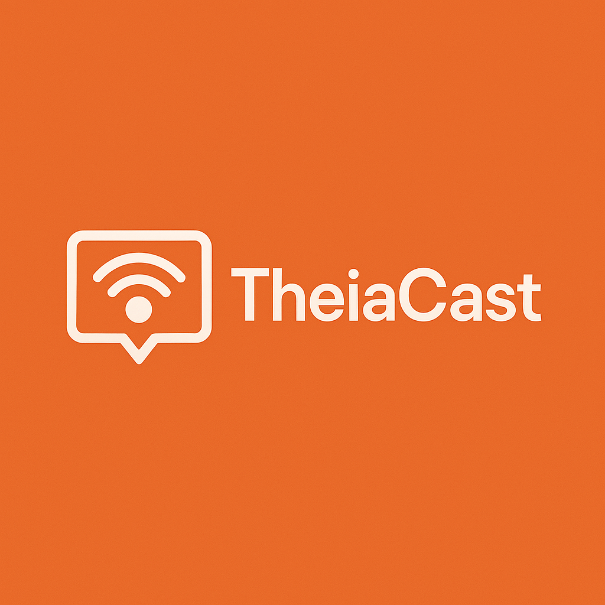

[](https://github.com/jimmyeao/TheiaCast/actions/workflows/codeql.yml)

# TheiaCast - Professional Digital Signage Solution



[](https://github.com/jimmyeao/TheiaCast/releases)
[](https://www.gnu.org/licenses/agpl-3.0)
[](https://dotnet.microsoft.com/)
[](https://reactjs.org/)

A comprehensive web-based digital signage solution with centralized management, real-time monitoring, and advanced remote control capabilities. Perfect for managing displays across multiple locations with support for Windows PCs, Intel NUCs, and Raspberry Pi devices.

## ✨ Key Features

- 🖥️ **Central Management Dashboard** - Control all displays from one web interface
- 📺 **Live Device Monitoring** - Real-time view of what's displayed on each device
- 🎮 **Remote Control** - Interact with displays remotely (click, type, navigate)
- 📋 **Content Playlists** - Create and schedule content with rotation timers
- 💾 **Offline Caching** - Automatic content caching for seamless playback
- 🔒 **Security** - JWT authentication with 2FA support
- 📱 **Cross-Platform** - Windows and Raspberry Pi client support
- 🔄 **Real-time Updates** - WebSocket-based instant configuration changes

## 📸 Screenshots

### Device Management Dashboard


*Centralized view of all connected displays with live status monitoring*

### Device Control Actions


*Quick access to device actions: screenshots, remote control, configuration*

### Content Library Management


*Organize and manage your digital signage assets*

### Playlist Management


*Create and manage content playlists for different devices*

### Live Remote Control


*Real-time remote control interface with smart home integration*

### Security & Settings


*Two-factor authentication and administrative controls*

## 🚀 Quick Start

### Option 1: Docker (Recommended)
Get up and running in minutes with Docker Compose:

```bash
# Clone the repository
git clone https://github.com/jimmyeao/TheiaCast.git
cd TheiaCast

# Start all services
docker-compose up -d
```

**Access your installation:**
- **Web Interface**: http://localhost:5173
- **API**: http://localhost:5001
- **Default Login**: admin / admin123 ⚠️ *Change immediately!*

### Option 2: Development Setup

#### Prerequisites
- .NET 10 SDK - [Download](https://dotnet.microsoft.com/download/dotnet/10.0)
- Node.js 20+ - [Download](https://nodejs.org/)
- PostgreSQL 12+ - [Download](https://www.postgresql.org/download/)

#### Setup Steps

```bash
# 1. Clone the repository
git clone https://github.com/jimmyeao/TheiaCast.git
cd TheiaCast

# 2. Install frontend dependencies (using npm workspaces)
npm install

# 3. Start database
docker-compose up postgres -d
# Or use local PostgreSQL and update connection string

# 4. Start backend (.NET 10)
cd src/TheiaCast.Api
dotnet restore
dotnet run

# Backend runs at: http://localhost:5001
# Swagger API docs: http://localhost:5001/swagger

# 5. In a new terminal, start frontend (React)
cd frontend
npm run dev

# Frontend runs at: http://localhost:5173
# Default login: admin / admin123
```

#### Building for Production

```bash
# Build backend
cd src/TheiaCast.Api
dotnet publish -c Release -o ../../publish/backend

# Build frontend
cd frontend
npm run build
# Output in: frontend/dist/

# Build clients (from project root)
npm run build --workspace=raspberrypi-client
# Output in: raspberrypi-client/dist/
```

## 📱 Client Installation

### Linux/Raspberry Pi Client

**Requirements:**
- Raspberry Pi OS (or any Linux distribution)
- Node.js 18+ (automatically installed if missing)
- Systemd (for service management)
- X11 display server

**Installation:**

1. **Download and extract:**
   ```bash
   # Download latest release
   wget https://github.com/jimmyeao/TheiaCast/releases/latest/download/theiacast-client-linux.tar.gz

   # Extract
   tar xzf theiacast-client-linux.tar.gz
   cd theiacast-client
   ```

2. **Run installation script:**
   ```bash
   sudo ./scripts/install.sh
   ```
   The script will:
   - Install Node.js if needed
   - Create systemd service
   - Prompt for server URL, device ID, and token
   - Configure auto-start

3. **Verify installation:**
   ```bash
   sudo systemctl status theiacast-client
   sudo journalctl -u theiacast-client -f
   ```

**Configuration:**
Edit `/opt/theiacast-client/.env` and restart:
```bash
sudo nano /opt/theiacast-client/.env
sudo systemctl restart theiacast-client
```

**One-Line Install (Alternative):**
```bash
curl -sSL https://raw.githubusercontent.com/jimmyeao/TheiaCast/main/install-pi.sh | bash
```

### Windows - Installer Package
Download the latest installer from [Releases](https://github.com/jimmyeao/TheiaCast/releases)

**Requirements:**
- Windows 10 or later
- .NET 10 Runtime (automatically installed by the installer)

**Installation:**

1. **Interactive Installation:**
   ```powershell
   # Download latest from https://github.com/jimmyeao/TheiaCast/releases/latest
   # Then run
   .\TheiaCast-Client-Windows-Setup.exe
   ```
   The installer will guide you through configuration.

2. **Silent Installation:**
   ```powershell
   # Automated deployment
   .\TheiaCast-Client-Windows-Setup.exe /VERYSILENT `
       /ServerUrl=http://your-server:5001 `
       /DeviceId=kiosk1 `
       /DeviceToken=your-device-token
   ```

**Post-Installation:**
- The client auto-starts via Task Scheduler on user login
- Chromium browser is bundled with the installer
- Configuration stored in: `C:\Program Files\TheiaCast\KioskClient\appsettings.json`

## 🏗️ Architecture

```
┌─────────────────────────────────────────────────────────────┐
│                   TheiaCast Digital Signage                 │
├─────────────────────────────────────────────────────────────┤
│  Frontend (React 19 + TypeScript)                          │
│  ├── Device Management Dashboard                           │
│  ├── Content Library & Playlists                          │
│  ├── Live Monitoring & Remote Control                     │
│  └── Settings & Authentication                            │
├─────────────────────────────────────────────────────────────┤
│  Backend (ASP.NET Core 8 + PostgreSQL)                    │
│  ├── RESTful API + WebSocket                             │
│  ├── Device Authentication & Management                   │
│  ├── Content Storage & Streaming                         │
│  └── Real-time Communication                             │
├─────────────────────────────────────────────────────────────┤
│  Client Applications                                       │
│  ├── Raspberry Pi Client (Node.js + Puppeteer)          │
│  └── Windows Client (.NET 10 + Playwright)              │
└─────────────────────────────────────────────────────────────┘
```

## 🔧 Technology Stack

| Component | Technology |
|-----------|------------|
| **Backend** | ASP.NET Core 10 (C#) + PostgreSQL |
| **Frontend** | React 19 + TypeScript + Tailwind CSS |
| **Pi Client** | Node.js + Puppeteer + Chromium |
| **Windows Client** | .NET 10 + Playwright |
| **Communication** | WebSockets + REST API |
| **Authentication** | JWT + 2FA Support |

## 📁 Project Structure

```
TheiaCast/
├── 📁 src/
│   ├── 📁 TheiaCast.Api/        # ASP.NET Core 8 API server
│   └── 📁 TheiaCast.sln         # Visual Studio solution
├── 📁 frontend/                 # React admin dashboard
├── 📁 raspberrypi-client/       # Pi client (Node.js)
├── 📁 client-windows/           # Windows client (.NET)
├── 📁 shared/                   # TypeScript shared types
├── 📁 scripts/                  # Deployment scripts
├── 📁 deploy/                   # Docker configurations
└── 📄 docker-compose.yml        # Quick start setup
```

## ⚙️ Configuration

### Environment Variables

#### Server Configuration
```bash
# .env or docker-compose.yml
POSTGRES_PASSWORD=your-secure-password
JWT_SECRET=your-long-random-secret-minimum-32-chars
ASPNETCORE_URLS=http://localhost:5001
```

#### Raspberry Pi Client
```bash
# raspberrypi-client/.env
SERVER_URL=http://your-server:5001
DEVICE_ID=your-unique-device-id
DEVICE_TOKEN=token-from-admin-ui
DISPLAY_WIDTH=1920
DISPLAY_HEIGHT=1080
KIOSK_MODE=true
```

#### Windows Client
```json
// appsettings.json
{
  "ServerUrl": "http://your-server:5001",
  "DeviceId": "your-unique-device-id", 
  "DeviceToken": "token-from-admin-ui",
  "KioskMode": true
}
```

## 🌐 Production Deployment

### Server Deployment

#### Option 1: Docker (Recommended)

Docker images are automatically built and published for each release.

**Using Docker Compose:**
```bash
# Clone the repository
git clone https://github.com/jimmyeao/TheiaCast.git
cd TheiaCast

# Configure environment
cp .env.example .env
nano .env  # Update settings

# Start services
docker-compose -f docker-compose.prod.yml up -d
```

**Using Pre-built Images:**
```bash
# Pull images
docker pull ghcr.io/jimmyeao/theiacast-backend:latest
docker pull ghcr.io/jimmyeao/theiacast-frontend:latest

# Run backend
docker run -d \
  -p 5001:8080 \
  -e ConnectionStrings__Default="Host=postgres;Database=theiacast;Username=postgres;Password=yourpassword" \
  -e Jwt__Secret="your-secret-key-min-32-chars" \
  --name theiacast-backend \
  ghcr.io/jimmyeao/theiacast-backend:latest

# Run frontend
docker run -d \
  -p 80:80 \
  -e VITE_API_URL=http://your-server:5001 \
  --name theiacast-frontend \
  ghcr.io/jimmyeao/theiacast-frontend:latest
```

#### Option 2: Manual Deployment

**Backend:**
```bash
cd src/TheiaCast.Api

# Publish self-contained for your platform
dotnet publish -c Release \
  -r linux-x64 \
  --self-contained true \
  -p:PublishSingleFile=true \
  -o publish

# Run
cd publish
./TheiaCast.Api

# Or as a systemd service
sudo nano /etc/systemd/system/theiacast.service
sudo systemctl enable theiacast
sudo systemctl start theiacast
```

**Frontend:**
```bash
cd frontend

# Build for production
npm run build

# Deploy to web server
# Option 1: Nginx
sudo cp -r dist/* /var/www/html/theiacast/

# Option 2: Apache
sudo cp -r dist/* /var/www/html/

# Option 3: Node.js serve
npx serve dist -l 5173
```

**Database Setup:**
```sql
-- Create database
CREATE DATABASE theiacast;

-- Connection string
Host=localhost;Port=5432;Database=theiacast;Username=postgres;Password=yourpassword
```

### Client Deployment

#### Raspberry Pi Mass Deployment

**Using the installation package:**
```bash
# Download latest release
wget https://github.com/jimmyeao/TheiaCast/releases/latest/download/theiacast-client-linux.tar.gz
tar xzf theiacast-client-linux.tar.gz
cd theiacast-client

# Install with pre-configured settings
sudo ./scripts/install.sh

# Or configure via environment file
sudo nano /opt/theiacast-client/.env
sudo systemctl restart theiacast-client
```

**Using configuration management:**
```bash
# Ansible, Puppet, or custom scripts
# Deploy tarball and run install.sh with environment variables
export SERVER_URL=http://your-server:5001
export DEVICE_ID=pi-${HOSTNAME}
export DEVICE_TOKEN=$(curl -X POST http://your-server:5001/devices ...)

sudo ./scripts/install.sh
```

#### Windows Mass Deployment
```powershell
# Silent installation on multiple PCs
$devices = @("kiosk1", "kiosk2", "office1")
foreach($device in $devices) {
    .\TheiaCast-Setup.exe /VERYSILENT `
        /ServerUrl=http://your-server:5001 `
        /DeviceId=$device `
        /DeviceToken=(Get-TokenFromAPI $device)
}
```

## 📖 Advanced Features

### Remote Browser Control
- **Interactive Control**: Click, type, and navigate on remote displays
- **Authentication Handling**: Manage logins and MFA prompts remotely
- **Live Streaming**: Real-time view of device screens

### Smart Playlist Management
- **Scheduled Content**: Time-based content rotation
- **Global Broadcasting**: Emergency message override
- **Content Caching**: Automatic local storage for reliability

### Device Health Monitoring
- **System Metrics**: CPU, memory, disk usage tracking
- **Connection Status**: Real-time connectivity monitoring
- **Automated Alerts**: Notification system for device issues

## 📚 Documentation

- 📖 [Raspberry Pi Installation Guide](./README-PI-INSTALL.md)
- 🖥️ [Windows Client Documentation](./client-windows/README.md)
- 🎮 [Remote Control Features](./REMOTE-CONTROL.md)
- 🔧 [API Documentation](http://localhost:5001/swagger) (when running)

## 🤝 Contributing

1. **Fork** the repository
2. **Create** a feature branch (`git checkout -b feature/amazing-feature`)
3. **Commit** your changes (`git commit -m 'Add amazing feature'`)
4. **Push** to the branch (`git push origin feature/amazing-feature`)
5. **Open** a Pull Request

## 📄 License

This project is licensed under the **GNU Affero General Public License v3.0 (AGPL-3.0)** - see the [LICENSE](LICENSE) file for details.

### What does AGPL v3 mean?

- ✅ **Free to use** for personal and non-commercial purposes
- ✅ **Modify and distribute** - you can change the code and share it
- ✅ **Open source** - all modifications must be open-sourced under AGPL v3
- ⚠️ **Network use = Distribution** - if you run a modified version as a service, you must share the source code
- 💼 **Commercial use** - contact us for commercial licensing options for businesses requiring >4 screens

For commercial licensing inquiries, please contact: [commercial@yourwebsite.com](mailto:commercial@yourwebsite.com)

## 🆘 Support & Troubleshooting

### Common Issues

**Client won't connect?**
```bash
# Check connectivity
curl http://your-server:5001/healthz

# Verify device token
# Check logs: sudo journalctl -u pds-client -f
```

**Chromium not found on Pi?**
```bash
sudo apt-get install chromium chromium-codecs-ffmpeg
```

**Need help?** Open an [issue](https://github.com/jimmyeao/TheiaCast/issues) with:
- System information
- Log files
- Steps to reproduce

---

<div align="center">

**⭐ Star this project if you find it useful!**

Made with ❤️ by [Jimmy White](https://github.com/jimmyeao)

[🐛 Report Bug](https://github.com/jimmyeao/TheiaCast/issues) • [✨ Request Feature](https://github.com/jimmyeao/TheiaCast/issues) • [📖 Documentation](https://github.com/jimmyeao/TheiaCast/wiki)

</div>
